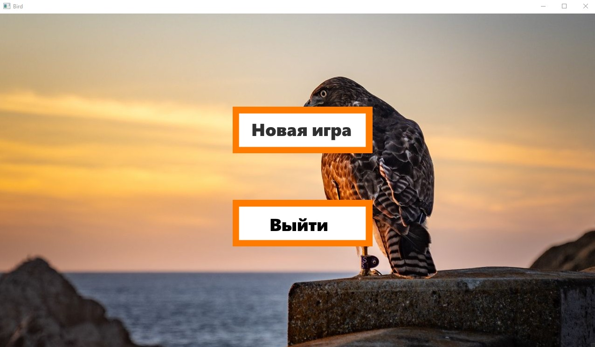
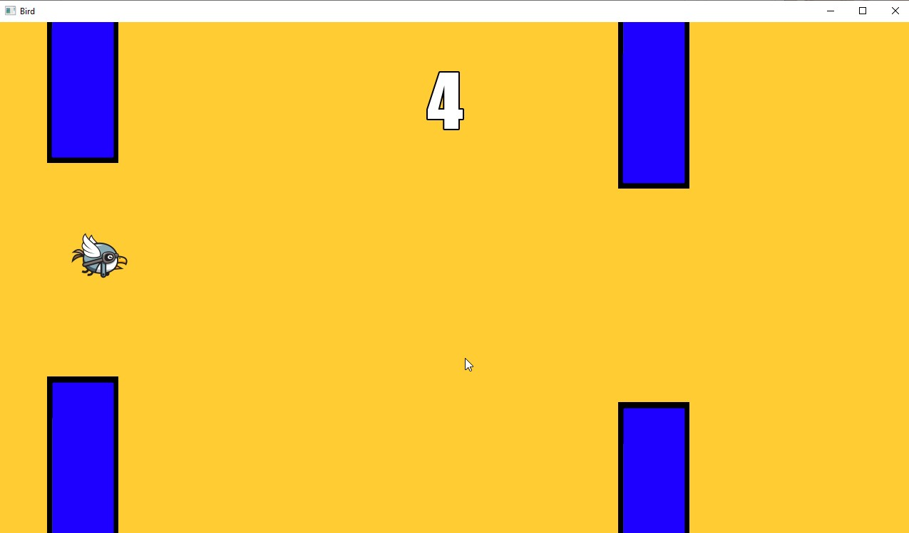

# Bird game

Игра Bird, написанная на С++ с использованием библиотеки SFML.

Меню


Игра


Game Over


# Управление

Меню

- Нажмите кнопку Новая игра, чтобы запуститься игру.
- Нажмите кнопку Выйти, чтобы выйти.

Игра

- Нажмите клавишу "Space" для перемещения вверх.
- Нажмите клавишу Tab для выхода в меню.
- Если птица прикоснётся к препятствию, то игра проиграна.
- При проигрыше появится окно Game Over.

Game Over
- Нажмите кнопку Новая игра для перезапуска игры.
- Нажмите клавишу Tab для выхода в меню.


# Требования
1. Скачать и установить vcpkg:
```markdown
git clone https://github.com/microsoft/vcpkg.git
cd vcpkg
bootstrap-vcpkg.bat
vcpkg integrate install
```

3. Скачать и установить CMake

4. Скачать SFML:
```markdown
vcpkg install sfml:x64-windows
```

6. Клонировать репозиторий:
```markdown
git clone https://github.com/nKadykov/bird_project.git
```

8. Создать папку с проектом:
```markdown
mkdir build
cd build
```

10. Собрать проект:
```markdown
cmake .. -DCMAKE_TOOLCHAIN_FILE=C:/path/to/vcpkg/scripts/buildsystems/vcpkg.cmake
```
Заменить C:/path/to/vcpkg на путь к vcpkg
```markdown
cmake --build
```
